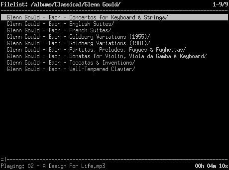

Description
-----------

``cplay`` is a minimalist music player with a textual user interface
written in Python. It aims to provide a power-user-friendly interface
with simple filelist and playlist control.

Instead of building an elaborate database of your music library,
``cplay`` allows you to quickly browse the filesystem and enqueue
files, directories, and playlists.

The original cplay was started by Ulf Betlehem in 1998 and is no longer
maintained.  This is a rewrite that aims to stay true to the original design
while evolving with a shifting environment.

Requirements
------------

- `python3 <http://www.python.org/>`_
- `mpv <https://mpv.io/>`_
- pulseaudio-utils, specifically the ``pactl`` command

Installation
------------

::

    $ pip install cplay-ng

Usage
-----

::

    $ cplay-ng

Press ``h`` to get a list of available keys.
